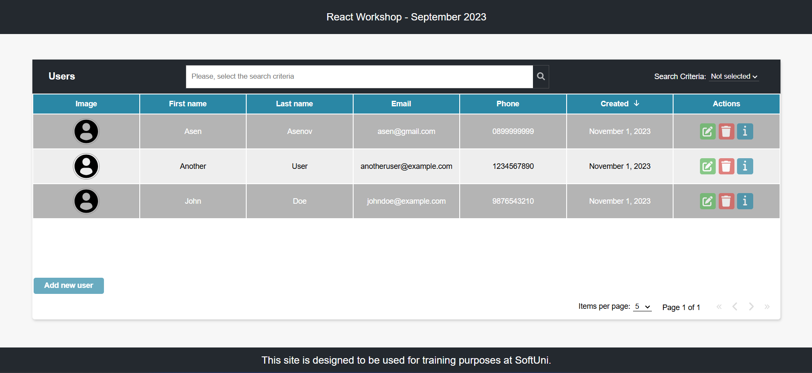

# user-list

A modern, full-stack React application for managing users, built as part of the SoftUni React Course Workshop.

---



---

## ✨ Features

- **Authentication**: Secure login using SoftUni Practice Server credentials
- **User Management**: Add, edit, delete, and view user details
- **Search & Pagination**: Filter users and navigate through paginated results
- **Responsive UI**: Clean, user-friendly interface
- **Modern React**: Hooks, Context API, and modular components
- **Persistent Auth**: Auth state stored in session storage

---

## 🚀 Quick Start

1. **Clone the repo:**
   ```bash
   git clone https://github.com/TeodorIliev06/user-list.git
   cd user-list
   ```

2. **Install dependencies:**
   ```bash
   cd client
   npm install
   ```

3. **Start the SoftUni Practice Server:**
   - Download or clone from [SoftUni Practice Server](https://github.com/softuni-practice-server/softuni-practice-server)
   - Run:
     ```bash
     node server/server.js
     ```
   - The server runs on `http://localhost:3030` by default.

4. **Start the React client:**
   ```bash
   npm run dev
   ```
   - The app will be available at `http://localhost:5173`

## 📁 Project Structure

```
user-list/
  ├── client/           # React frontend
  │   ├── src/
  │   │   ├── api/      # API request logic
  │   │   ├── components/ # UI components
  │   │   ├── contexts/ # React Context providers
  │   │   ├── hooks/    # Custom React hooks
  │   │   ├── styles.css
  │   │   └── main.jsx
  │   ├── public/
  │   └── package.json
  ├── server/           # SoftUni Practice Server (external)
  └── README.md
```

---

## 🛠️ Built With

- **React** (Vite, Context API, Hooks)
- **SoftUni Practice Server** (REST API, token-based auth)
- **CSS** (custom styles)
- **ESLint** (code quality)

---

## 📚 Learn More

- [SoftUni Practice Server Documentation](https://github.com/softuni-practice-server/softuni-practice-server)
- [React Documentation](https://react.dev/)

---

## 📝 License

MIT
